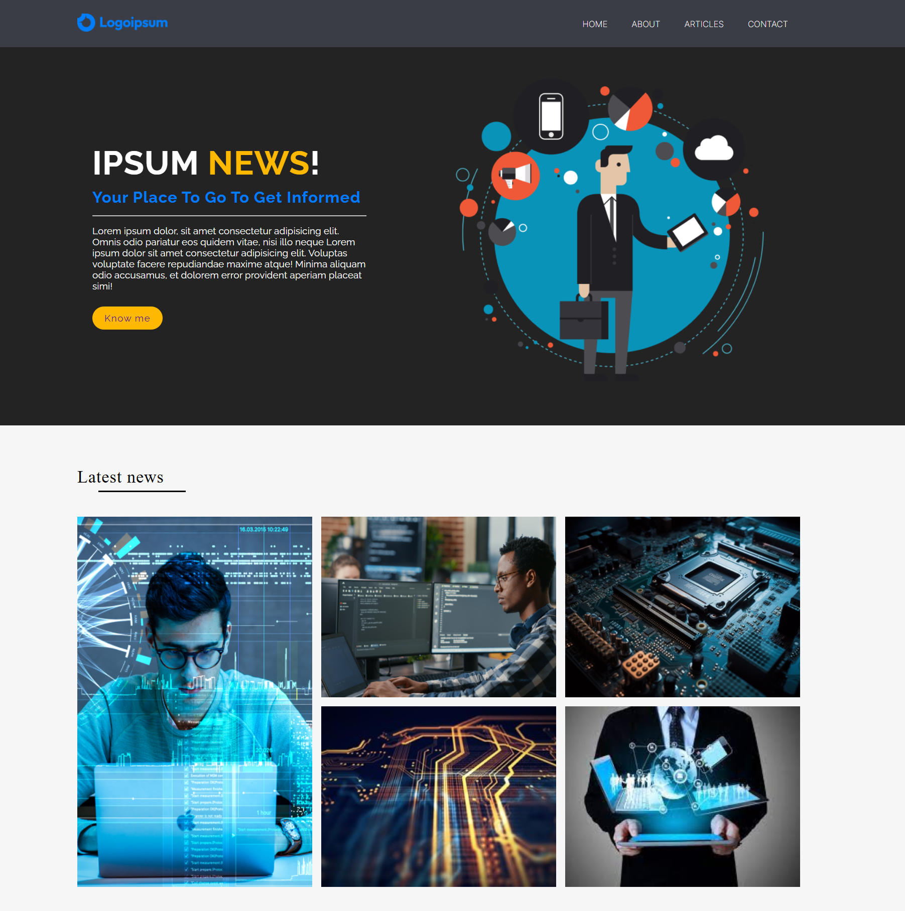

<h1 align="center"> 🌟 Modern Grid Layout Project 🌟

## 📸 Demo

  

---

## 📖 Description
This project consists of a modern and responsive web page using **CSS Grid** for layout structuring. The goal was to efficiently organize content in a two-dimensional approach, allowing seamless element positioning across the page.

---

## 🔧 Technologies Used
- **HTML5**: Semantic structure for accessibility and clarity.
- **CSS3 (Grid & Flexbox)**: Layout and styling for responsiveness.
- **Figma**: Used as a design reference.

---

## 🎨 Project Structure
- **Header**: Contains a logo and a navigation menu with links (Home, About, Articles, Contact).
- **Main Section**: Features an illustrated visual, a catchy headline, an introduction paragraph, and a call-to-action button.
- **News Grid**: Displays the latest news in a CSS Grid layout, ensuring a fluid and harmonious arrangement of images.

---

## 🔥 Key Features
- **CSS Grid for structured content organization** across adaptive columns and rows.
- **Flexbox for precise alignment** of navigation and main section elements.
- **High-contrast color palette** for readability and a modern design.

---

## 📌 Possible Improvements
- Enhance animations for a more interactive user experience.
- Optimize the design for better accessibility compliance.

---

<h1 align="center"> 🌟 Projet de Mise en Page Moderne avec Grid 🌟

---

## 📖 Description
Ce projet consiste en une page web moderne et responsive utilisant **CSS Grid** pour la structuration de la mise en page. L'objectif était d'organiser efficacement le contenu avec une approche en deux dimensions, permettant un positionnement fluide des éléments sur la page.

---

## 🔧 Technologies Utilisées
- **HTML5** : Structure sémantique pour l'accessibilité et la clarté.
- **CSS3 (Grid & Flexbox)** : Mise en page et styles pour la responsivité.
- **Figma** : Utilisé comme référence de design.

---

## 🎨 Structure du Projet
- **En-tête** : Contient un logo et une navigation avec des liens (Home, About, Articles, Contact).
- **Section principale** : Présente un visuel illustré, un titre accrocheur, un paragraphe d'introduction et un bouton d'appel à l'action.
- **Grille des actualités** : Affichage des dernières nouvelles sous forme de **CSS Grid**, garantissant une disposition fluide et harmonieuse des images.

---

## 🔥 Points Clés
- **Utilisation de CSS Grid pour organiser le contenu** en colonnes et lignes adaptatives.
- **Flexbox pour l'alignement précis** des éléments de navigation et de la section principale.
- **Palette de couleurs contrastée** pour assurer une bonne lisibilité et un design moderne.

---

## 📌 Améliorations Possibles
- Améliorer les animations pour une meilleure interactivité.
- Optimiser le design pour une meilleure accessibilité.
